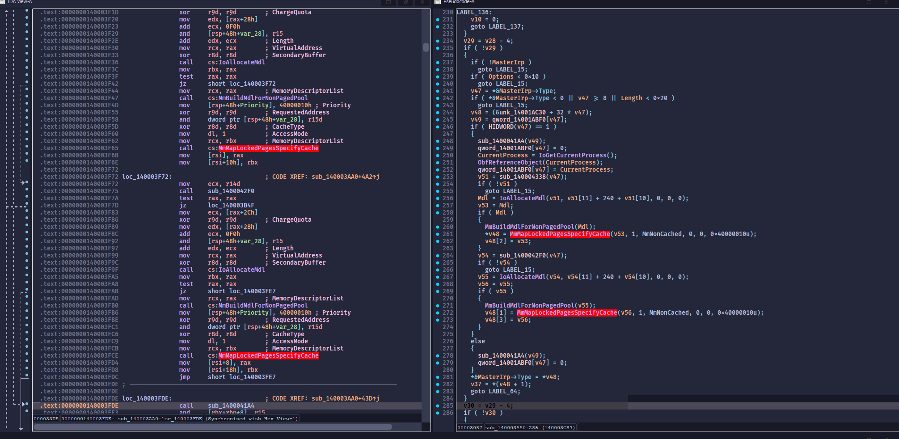

# CVE-2025-34431: VB-Audio Voicemeeter & Matrix Drivers DoS via MmMapLockedPagesSpecifyCache

**CVSS Score:** 6.9  
**CVSS Severity:** Medium  
**Vector:** `CVSS:4.0/AV:L/AC:L/AT:N/PR:N/UI:N/VC:N/VI:N/VA:H/SC:N/SI:N/SA:N`  
**CWE ID:** `CWE-755 Improper Handling of Exceptional Conditions`

## Vulnerability description

VB-Audio Voicemeeter, Voicemeeter Banana, and Voicemeeter Potato (versions ending in 1.1.1.9, 2.1.1.9, and 3.1.1.9 and earlier, respectively), as well as VB-Audio Matrix and Matrix Coconut (versions ending in 1.0.2.2 and 2.0.2.2 and earlier, respectively), contain a vulnerability in their virtual audio drivers (vbvoicemeetervaio64*.sys, vbmatrixvaio64*.sys, vbaudio_vmauxvaio*.sys, vbaudio_vmvaio*.sys, and vbaudio_vmvaio3*.sys). The drivers map non-paged pool memory into user space via MmMapLockedPagesSpecifyCache using UserMode access without proper exception handling. If the mapping fails, such as when a process has exhausted available virtual address space, MmMapLockedPagesSpecifyCache raises an exception that is not caught, causing a kernel crash (BSoD), typically SYSTEM_SERVICE_EXCEPTION with STATUS_NO_MEMORY. This flaw allows a local unprivileged user to trigger a denial-of-service on affected Windows systems.

## Vendor Information

Vendor: VB-Audio Software  
Vendor URL: https://vb-audio.com/

## Affected Products

| Product | Link | Archived Download Link
| :--- | :--- | :--- |
| VB-Audio Voicemeeter (Standard) $\le 1.1.1.9$ | https://vb-audio.com/Voicemeeter/index.htm | https://web.archive.org/web/20251119122339/https://download.vb-audio.com/Download_CABLE/VoicemeeterSetup_v1119.zip |
| VB-Audio Voicemeeter Banana $\le 2.1.1.9$ | https://vb-audio.com/Voicemeeter/banana.htm | https://web.archive.org/web/20251119122402/https://download.vb-audio.com/Download_CABLE/VoicemeeterSetup_v2119.zip |
| VB-Audio Voicemeeter Potato $\le 3.1.1.9$ | https://vb-audio.com/Voicemeeter/potato.htm | https://web.archive.org/web/20250328092122/https://download.vb-audio.com/Download_CABLE/Voicemeeter8Setup_v3119.zip |
| VB-Audio Matrix $\le 1.0.2.2$ | https://vb-audio.com/Matrix/index.htm | https://web.archive.org/web/20251119123419/https://download.vb-audio.com/Download_Mixer/VBAudioMatrix_Setup_v1022.zip |
| VB-Audio Matrix Coconut $\le 2.0.2.2$ | https://vb-audio.com/Matrix/coconut.htm | https://web.archive.org/web/20251112152421/https://download.vb-audio.com/Download_Mixer/VBAudioMatrix_Setup_v2022.zip |

> [!NOTE]
> Voicemeeter Potato installation also includes Voicemeeter Banana and Voicemeeter (Standard).   
> Voicemeeter Banana installation also includes Voicemeeter (Standard). 

| Vulnerable Driver | OS | Installed With
| :--- | :--- | :--- |
| vbmatrixvaio64\*_win10.sys $\le 3.4.1.3$ | Win 10/11 | Matrix, Matrix Coconut | 
| vbvoicemeetervaio64\*_win10.sys $\le 3.3.1.9$ | Win 10/11 | Voicemeeter, Voicemeeter Banana, Voicemeeter Potato $\ge \*.1.0.0$| 
| vbaudio_vmauxvaio\*.sys $\le 2.1.5.2$ | Win 7/10/11 | Voicemeeter, Voicemeeter Banana, Voicemeeter Potato $\le \*.1.0.0$|
| vbaudio_vmvaio\*.sys $\le 2.1.5.2$ | Win 7/10/11 | Voicemeeter, Voicemeeter Banana, Voicemeeter Potato $\le \*.1.0.0$|
| vbaudio_vmvaio3\*.sys $\le 2.1.5.2$ | Win 7/10/11 | Voicemeeter, Voicemeeter Banana, Voicemeeter Potato $\le \*.1.0.0$|

> [!NOTE]
> Voicemeeter installation package includes every variation of the drivers, i.e.: 32/64 bit, x64/ARM, as well as variants for different Windows versions (2003, Vista, XP, Win7, Win10). The list above uses wildcards in the driver name to account for the different suffixes. The codebase for all those different versions is the same.

## Tested Environments
- `Windows 11, Version 10.0.26100 Build 26100`
- `Windows 10, Version 10.0.19045 Build 19045`
- `Windows 7, Version 6.1.7601 Service Pack 1 Build 7601`

## Technical Details

A handle to the driver must be created by using `CreateFileA` with `dwFlagsAndAttributes` of `0x800`. The driver checks this value specifically to recognize Voicemeeter / Matrix opening the handle.

In the `MajorFunction[IRP_MJ_DEVICE_CONTROL]` handler function, the driver maps non-paged pool kernel memory allocated with `ExAllocatePool2` / `ExAllocatePoolWithTag` into user space with `MmMapLockedPagesSpecifyCache` with IOCTL `0x222054` (`vbvoicemeetervaio64*_win10.sys` and `vbmatrixvaio64*_win10.sys`), IOCTL `0x222044` (`vbaudio_vmauxvaio*.sys`, `vbaudio_vmvaio*.sys` and `vbaudio_vmvaio3*.sys`) and IOCTL `0x222060` (`vbmatrixvaio64*_win10.sys`).

No exception handling is performed by the driver for calls to `MmMapLockedPagesSpecifyCache`. This violates Microsoft driver development guidelines: https://learn.microsoft.com/en-us/windows-hardware/drivers/ddi/wdm/nf-wdm-mmmaplockedpagesspecifycache#remarks

> If AccessMode is UserMode, be aware of the following details:
> 
> If the specified pages cannot be mapped, the routine raises an exception. Callers that specify UserMode must wrap the call to 
> MmMapLockedPagesSpecifyCache in a try/except block. For more information, see Handling Exceptions.

`MmMapLockedPagesSpecifyCache` generates an exception under various conditions, for example when the memory mapping can't be performed because there is no more free virtual memory available in the target user space process. This condition can be easily forced by an unprivileged local attacker, causing a BSoD:

1. Open a handle to the driver.
2. Exhaust virtual address space by using VirtualAlloc in a loop (easy for a 32bit process).
3. Use IOCTL `0x222054`, `0x222044` or `0x222060` (depending on the version)
4. A BSoD is caused in `MmMapLockedPagesSpecifyCache` call (`SYSTEM_SERVICE_EXCEPTION` with exception `STATUS_NO_MEMORY`).

## How to reproduce

1. Install Windows 11 in a VM.
2. Download and install one of the products listed above.
3. Compile the PoC code using latest MSVC 32bit.
4. Run the PoC executable.

## Screenshots

### IDA decompilation of the IOCTL handler function in `vbvoicemeetervaio64_win10.sys`

The screenshot demonstrates missing try/catch blocks near the `MmMapLockedPagesSpecifyCache` calls in the disassembly view, which IDA would display if they were present. Definitive proof of missing exception handling is done via the PoC code.

