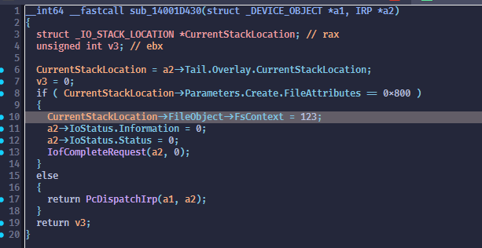

# CVE-2026-23761: VB-Audio Voicemeeter & Matrix Drivers DoS via Improper FILE_OBJECT FsContext Initialization

**CVSS Score:** 6.9  
**CVSS Severity:** Medium  
**Vector:** `CVSS:4.0/AV:L/AC:L/AT:N/PR:N/UI:N/VC:N/VI:N/VA:H/SC:N/SI:N/SA:N`  
**CWE ID:** `CWE-824 Access of Uninitialized Pointer`

## Vulnerability description

VB-Audio Voicemeeter, Voicemeeter Banana, and Voicemeeter Potato (versions ending in 1.1.1.9, 2.1.1.9, and 3.1.1.9 and earlier, respectively), as well as VB-Audio Matrix and Matrix Coconut (versions ending in 1.0.2.2 and 2.0.2.2 and earlier, respectively), contain a vulnerability in their virtual audio drivers (vbvoicemeetervaio64*.sys, vbmatrixvaio64*.sys, vbaudio_vmauxvaio*.sys, vbaudio_vmvaio*.sys, and vbaudio_vmvaio3*.sys). When a handle is opened with a special file attribute value, the drivers improperly initialize FILE_OBJECT->FsContext to a non-pointer magic value. If subsequent operations are not handled by the VB-Audio driver and are forwarded down the audio driver stack (e.g., via PortCls to ks.sys), the invalid FsContext value can be dereferenced, causing a kernel crash (BSoD), typically SYSTEM_SERVICE_EXCEPTION with STATUS_ACCESS_VIOLATION. This flaw allows a local unprivileged user to trigger a denial-of-service on affected Windows systems.

## Vendor Information

Vendor: VB-Audio Software  
Vendor URL: https://vb-audio.com/

## Affected Products

| Product | Link | Archived Download Link
| :--- | :--- | :--- |
| VB-Audio Voicemeeter (Standard) $\le 1.1.1.9$ | https://vb-audio.com/Voicemeeter/index.htm | https://web.archive.org/web/20251119122339/https://download.vb-audio.com/Download_CABLE/VoicemeeterSetup_v1119.zip |
| VB-Audio Voicemeeter Banana $\le 2.1.1.9$ | https://vb-audio.com/Voicemeeter/banana.htm | https://web.archive.org/web/20251119122402/https://download.vb-audio.com/Download_CABLE/VoicemeeterSetup_v2119.zip |
| VB-Audio Voicemeeter Potato $\le 3.1.1.9$ | https://vb-audio.com/Voicemeeter/potato.htm | https://web.archive.org/web/20250328092122/https://download.vb-audio.com/Download_CABLE/Voicemeeter8Setup_v3119.zip |
| VB-Audio Matrix $\le 1.0.2.2$ | https://vb-audio.com/Matrix/index.htm | https://web.archive.org/web/20251119123419/https://download.vb-audio.com/Download_Mixer/VBAudioMatrix_Setup_v1022.zip |
| VB-Audio Matrix Coconut $\le 2.0.2.2$ | https://vb-audio.com/Matrix/coconut.htm | https://web.archive.org/web/20251112152421/https://download.vb-audio.com/Download_Mixer/VBAudioMatrix_Setup_v2022.zip |

> [!NOTE]
> Voicemeeter Potato installation also includes Voicemeeter Banana and Voicemeeter (Standard).   
> Voicemeeter Banana installation also includes Voicemeeter (Standard). 

| Vulnerable Driver | OS | Installed With
| :--- | :--- | :--- |
| vbmatrixvaio64\*_win10.sys $\le 3.4.1.3$ | Win 10/11 | Matrix, Matrix Coconut | 
| vbvoicemeetervaio64\*_win10.sys $\le 3.3.1.9$ | Win 10/11 | Voicemeeter, Voicemeeter Banana, Voicemeeter Potato $\ge \*.1.0.0$| 
| vbaudio_vmauxvaio\*.sys $\le 2.1.5.2$ | Win 7/10/11 | Voicemeeter, Voicemeeter Banana, Voicemeeter Potato $\le \*.1.0.0$|
| vbaudio_vmvaio\*.sys $\le 2.1.5.2$ | Win 7/10/11 | Voicemeeter, Voicemeeter Banana, Voicemeeter Potato $\le \*.1.0.0$|
| vbaudio_vmvaio3\*.sys $\le 2.1.5.2$ | Win 7/10/11 | Voicemeeter, Voicemeeter Banana, Voicemeeter Potato $\le \*.1.0.0$|

> [!NOTE]
> Voicemeeter installation package includes every variation of the drivers, i.e.: 32/64 bit, x64/ARM, as well as variants for different Windows versions (2003, Vista, XP, Win7, Win10). The list above uses wildcards in the driver name to account for the different suffixes. The codebase for all those different versions is the same.

## Tested Environments
- `Windows 11, Version 10.0.26100 Build 26100`
- `Windows 10, Version 10.0.19045 Build 19045`
- `Windows 7, Version 6.1.7601 Service Pack 1 Build 7601`

## Technical Details

In the `DriverObject->MajorFunction[IRP_MJ_CREATE]` handler function, the driver assigns a magic value of `123` to the `FsContext` field of the `FILE_OBJECT` structure whenever a handle to the driver is created with `CreateFileA` and `dwFlagsAndAttributes` set to `0x800`. The driver uses this value to identify Voicemeeter / Matrix opening the handle. IOCTLs originating from Voicemeeter / Matrix are supposed to be completed in the VB-Audio driver via `IofCompleteRequest`, and not get forwarded to the PortCls system driver via `PcDispatchIrp`. However, by issuing an IOCTL that is not explicitly handled by the VB-Audio driver in the `IRP_MJ_DEVICE_CONTROL` handler function, the request is forwarded to the underlying driver stack via `PcDispatchIrp`. This causes the `FsContext` value to get dereferenced by `ks.sys`, which expects a valid pointer, causing a system crash (`SYSTEM_SERVICE_EXCEPTION` with `STATUS_ACCESS_VIOLATION`). A local, unprivileged attacker can exploit this mechanism:

1. Open a handle to the driver using a `dwFlagsAndAttributes` value of `0x800`, which sets `FsContext` to `123`
2. Issue an unsupported IOCTL that gets forwarded via `PcDispatchIrp`
3. A BSoD is triggered in `ks.sys` when the invalid `FsContext` pointer is dereferenced

The same bug can also be triggered by obtaining a driver handle as mentioned above, then performing a relative open using `NtCreateFile`, but without the magic file attribute value. The `NtCreateFile` call causes the `IRP_MJ_CREATE` handler function to be called again, but since the file attribute value is not set to the magic value `0x800`, the `if` check fails, and the request is forwarded via `PcDispatchIrp` to `ks.sys`. Because a relative open was performed, the underlying `FileObject` (and thus the faulty `FsContext` value of `123`) is the same, which causes a system crash when `ks.sys` dereferences the value. A local, unprivileged attacker can exploit this alternative mechanism:

1. Open a handle to the driver using a `dwFlagsAndAttributes` value of `0x800`, which sets `FsContext` to `123`
2. Use `NtCreateFile` to perform a relative open on the opened handle
3. A BSoD is triggered in `ks.sys` when the invalid `FsContext` pointer is dereferenced

## How to reproduce

1. Install Windows 11 in a VM.
2. Download and install one of the products listed above.
3. Compile the PoC code using latest MSVC 64bit.
4. Run the PoC executable, with either one of the two described exploits enabled.

## Screenshots

### IDA decompilation of the IRP_MJ_CREATE handler function in `vbvoicemeetervaio64_win10.sys`

The driver assigns the value `123` to `FsContext` when the `dwFlagsAndAttributes` is `0x800`

### IDA decompilation of `KsDispatchIrp` and `DispatchCreate` in `ks.sys`

`KsDispatchIrp` in `ks.sys` where `FileObject->FsContext` is accessed (IOCTL exploit variant)

`DispatchCreate` in `ks.sys` where `RelatedFileObject->FsContext` is accessed (relative open exploit variant)

