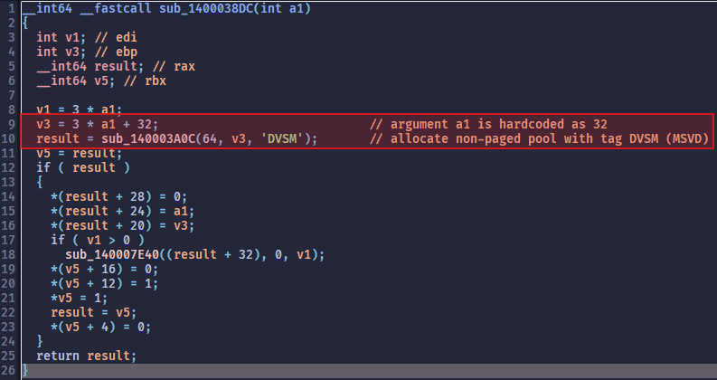
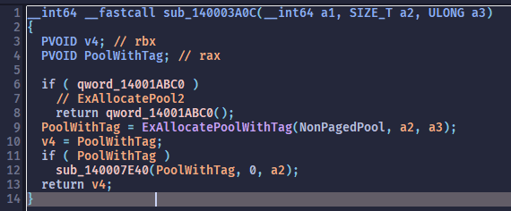

# CVE-2026-23763 VB-Audio Matrix Drivers Local Privilege Escalation via Kernel Memory Exposure

**CVSS Score:** 8.5  
**CVSS Severity:** High  
**Vector:** `CVSS:4.0/AV:L/AC:L/AT:N/PR:L/UI:N/VC:H/VI:H/VA:H/SC:N/SI:N/SA:N`  
**CWE ID:** `CWE-668 Exposure of Resource to Wrong Sphere`

## Vulnerability description

VB-Audio Matrix and Matrix Coconut (versions ending in 1.0.2.2 and 2.0.2.2 and earlier, respectively), contain a local privilege escalation vulnerability in the VBMatrix VAIO virtual audio driver (vbmatrixvaio64*_win10.sys). The driver allocates a 128-byte non-paged pool buffer and, upon receiving IOCTL 0x222060, maps it into user space using an MDL and MmMapLockedPagesSpecifyCache. Because the allocation size is not page-aligned, the mapping exposes the entire 0x1000-byte kernel page containing the buffer plus adjacent non-paged pool allocations with read/write permissions. An unprivileged local attacker can open a device handle (using the required 0x800 attribute flag), invoke the IOCTL to obtain the mapping, and then read or modify live kernel objects and pointers present on that page. This enables bypass of KASLR, arbitrary kernel memory read/write within the exposed page, corruption of kernel objects, and escalation to SYSTEM.

## Vendor Information

Vendor: VB-Audio Software  
Vendor URL: https://vb-audio.com/

## Affected Products

| Product | Link | Archived Download Link
| :--- | :--- | :--- |
| VB-Audio Matrix $\le 1.0.2.2$ | https://vb-audio.com/Matrix/index.htm | https://web.archive.org/web/20251119123419/https://download.vb-audio.com/Download_Mixer/VBAudioMatrix_Setup_v1022.zip |
| VB-Audio Matrix Coconut $\le 2.0.2.2$ | https://vb-audio.com/Matrix/coconut.htm | https://web.archive.org/web/20251112152421/https://download.vb-audio.com/Download_Mixer/VBAudioMatrix_Setup_v2022.zip |

> [!NOTE]
> VB-Audio Matrix Coconut installation also includes VB-Audio Matrix.   

| Vulnerable Driver | OS | Installed With
| :--- | :--- | :--- |
| vbmatrixvaio64\*_win10.sys $\le 3.4.1.3$ | Win 10/11 | Matrix, Matrix Coconut | 

## Tested Environments
- `Windows 11, Version 10.0.26100 Build 26100`
- `Windows 10, Version 10.0.19045 Build 19045`

## Technical Details

A handle to the driver must be created by using `CreateFileA` with `dwFlagsAndAttributes` of `0x800`. The driver checks this value specifically to recognize Matrix opening the handle.

During initialization, the driver allocates a buffer of size 128 bytes using `ExAllocatePool2` / `ExAllocatePoolWithTag` and tag "DVSM" (reversed "MSVD"). The allocation is placed into non-paged pool.

In the `MajorFunction[IRP_MJ_DEVICE_CONTROL]` handler function, the driver maps this buffer into user space via `IoAllocateMdl`, `MmBuildMdlForNonPagedPool` and `MmMapLockedPagesSpecifyCache` upon receiving IOCTL `0x222060`.

The allocation size for this buffer is 128 bytes, however, `MmMapLockedPagesSpecifyCache` maps the entire physical memory page (0x1000 bytes) into user space with read/write permissions. This allocation size violates Microsoft's driver development guidelines: https://learn.microsoft.com/en-us/windows-hardware/drivers/ddi/wdm/nf-wdm-mmmaplockedpagesspecifycache#remarks

> (...) In addition, the size of a user-mode buffer that is allocated from pool must be a multiple of the virtual memory page size to prevent any part of the pages in the buffer from being used for other allocations.

The mapped memory page contains non-paged pool allocation from other system drivers, identifiable via their pool tag. Exposed allocations contain live kernel objects and kernel pointers belonging to other system drivers and the OS kernel.

An unprivileged, local attacker can leverage this vulnerability to compromise the system:

1. Open a handle to the device with a `0x800` attribute flag.
2. Use IOCTL `0x222060` to map the kernel page into attacker-controlled user space with read/write permissions.
3. Scan the mapped page for `POOL_HEADER` structures and kernel pointers. This reveals the kernel base address and the location of dynamic allocations.
4. Identify a target kernel object via its pool tag (e.g., a process token or thread object) and use the write primitive to corrupt critical data structures directly.
5. By modifying a function pointer or security descriptor within the exposed memory page, the attacker achieves arbitrary code execution in Ring 0 or token manipulation.

The attached PoC code proves read/write permissions of the mapped page and direct access to live kernel objects and kernel pointers from user space by using `VirtualQuery` and checking for the `PAGE_READWRITE` flag, then scanning the page for pool tags and kernel pointers.

## How to reproduce

1. Install Windows 11 in a VM.
2. Download and install one of the products listed above.
3. Compile the PoC code using latest MSVC 64bit.
4. Run the PoC executable.

## Screenshots

### IDA decompilation of the IOCTL handler function in `vbmatrixvaio64*.sys`

### Where the driver allocates this 128 byte sized buffer in non-paged pool:

### Allocation function of the driver

